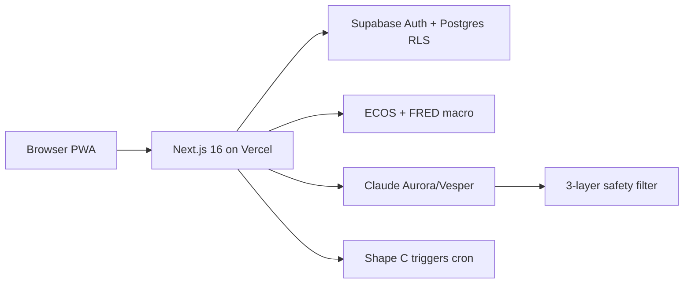

# Cohort

> Your investing cohort — the investing pace companion for sophisticated retail.

**Live:** [cohort.co.kr](https://www.cohort.co.kr/) · **Docs index:** [`docs/README.md`](docs/README.md)

Aurora 🕊 (patient pace) and Vesper 🦅 (sharp signals) help you stay on **your** plan — not ours.  
**Option B:** Information + Tool + Decision Support only. No investment advice, no auto-trading.

---

## Architecture at a glance (`main`)

| Path | What happens |
|------|----------------|
| `/dashboard` | Server-rendered macro snapshot (KST dates, ~15m cache) |
| Aurora brief | Cached by date in DB; safety-filtered narration |
| Chat | Quota by tier; bidirectional safety filter |
| Cron | **Trigger evaluation only** — not macro refresh |

**Full v1 diagram & file map:** [`docs/versions/v1-main/ARCHITECTURE.md`](docs/versions/v1-main/ARCHITECTURE.md)

---

## Version roadmap (docs-first)

| Version | Branch | Doc |
|---------|--------|-----|
| **v1** (now) | `main` | [`docs/versions/v1-main/`](docs/versions/v1-main/ARCHITECTURE.md) |
| **v2** (next) | `version/v2-engineering` | TDD/DDD, CI, Docker, IPS, BrokerPort — [`docs/versions/v2-engineering/`](docs/versions/v2-engineering/ARCHITECTURE.md) |
| **v3** (vision) | `version/v3-learning` | Quiz, quarterly review, backtest — [`docs/versions/v3-learning-cycle/`](docs/versions/v3-learning-cycle/VISION.md) |

**Before v2 branch:** [`docs/engineering/phase-0-closeout.md`](docs/engineering/phase-0-closeout.md)

Branch rules · agent PR workflow · journal: [`docs/engineering/`](docs/engineering/)

---

## Stack

| Layer | Technology |
|-------|------------|
| Frontend | Next.js 16 App Router, React 19, Tailwind 3.4, PWA |
| Backend | Supabase (Postgres, Auth, RLS) |
| AI | Claude (Sonnet chat/narration, Haiku safety) |
| Payments | Polar (USD support tier) |
| Analytics | PostHog, Sentry |
| Hosting | Vercel + Supabase managed |
| Runtime | Node ≥ 20.9 · **no NestJS** (Next monolith only) |
| Local dev | `docker compose up -d postgres` — [`docs/engineering/docker-local.md`](docs/engineering/docker-local.md) |

---

## Engineering

- **Deep dive + interview Q&A:** [`docs/architecture-system-design.md`](docs/architecture-system-design.md) *(not duplicated here)*
- **Work journal:** [`docs/journal/2026-06-v1-ship/JOURNAL.md`](docs/journal/2026-06-v1-ship/JOURNAL.md)
- **4-step product ladder (L1–L4):** [`docs/handoff-20260611/portfolio-tool-roadmap.md`](docs/handoff-20260611/portfolio-tool-roadmap.md)

---

## Brand

- **Name:** Cohort / 코호트 — Latin *cohors*, a group sharing a journey
- **Visual:** 석류 (pomegranate) · **Color:** `#A8243F`
- **Tagline:** 본인 plan과 cohort — 흔들리지 않는 페이스.

---

## License

Proprietary — Cohort (개인 운영) © 2026.
