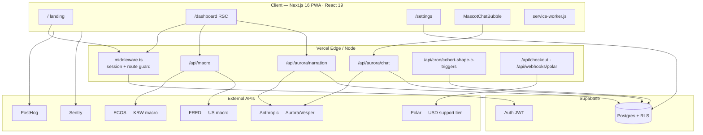
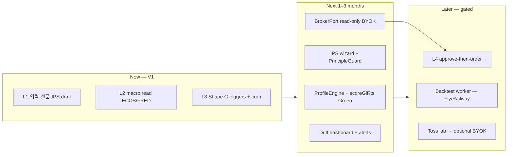

# Cohort — System Design & Interview Guide

> **Audience:** Ray (portfolio / tech interview prep)  
> **Last updated:** 2026-06-12 · **Stack:** Next.js 16 · React 19 · TS 5.9  
> **Live:** [cohort.co.kr](https://www.cohort.co.kr/)

> **Note:** This file is the **deep dive** (system design narration + CTO/practitioner Q&A).  
> **Public entry:** [`README.md`](../README.md) (current architecture only).  
> **Version SoT:** [`docs/versions/`](versions/) · **Index:** [`docs/README.md`](README.md)

---

## 1. Product boundary (30초 엘리베이터)

**Cohort** = 구독형 **정보 + 도구 + 의사결정 지원** PWA (Option B).  
투자 **일임·자문 아님**. 사용자 본인 IPS·브로커(BYOK)·데이터. 자금 비수탁.

---

## 2. Current architecture (V1 shipped / shipping)

### Request paths (면접용 3줄)

| Path | Pattern | Why |
|------|---------|-----|
| **Macro dashboard** | RSC `getMacroSnapshot()` → ECOS/FRED (15m in-memory cache, KST dates) | SEO 없음, fresh data, no page ISR |
| **Aurora brief** | RSC archive → client SWR POST `/api/aurora/narration` → Claude → `aurora_narration_log` | Tier-0 public brief; cache by `asOfDate` |
| **Chat** | Client → POST `/api/aurora/chat` → 3-layer safety filter → quota by tier | PIPA: anonymous UUID or authed user |

### Security & compliance highlights

- **RLS** on all user tables; admin client only server routes (webhook, cron, narration log).
- **Safety filter** (regex → Haiku → redirect) bidirectional on chat; output-side on narration.
- **No advisory copy** enforced in prompts + grep pre-push + unit tests.

---

## 3. Short-term roadmap architecture (Phase 2–4)

Detail ladder: `docs/handoff-20260611/portfolio-tool-roadmap.md` (L1–L4).

---

## 4. Tech stack (interview cheat sheet)

| Layer | Choice | Trade-off |
|-------|--------|-----------|
| UI | Next.js 16 App Router, React 19, RSC + client islands | Turbopack build; async `cookies()` / route `params` |
| Auth | Supabase Auth + middleware cookie refresh | No custom JWT server |
| DB | Postgres + RLS | PIPA delete cascade; no multi-tenant B2B yet |
| Pay | Polar MoR (USD support) | KRW Toss deferred |
| AI | Sonnet default, Haiku safety | Cost ~vault 62 model; quota per tier |
| Cron | Vercel `cohort-shape-c-triggers` | **Not** macro refresh — triggers only |
| Deploy | Vercel + Supabase managed | Hobby→Pro when commercial |

---

## 5. Enterprise / CTO / 실무 면접 — 예상 Q&A

### Architecture & scale

**Q: 왜 Next.js monolith? 언제 쪼개나?**  
A: Sprint 0 5-week cap, solo founder. Macro + API routes co-locate with UI. **Split trigger:** backtest worker (CPU-bound, Phase 4) → separate container; broker order router if L4 execution volume grows. Until then, `BrokerPort` interface hides broker adapters.

**Q: 매크로 데이터 stale 이슈는?**  
A: Was ISR 1h + UTC dates — fixed with `force-dynamic`, KST `kst-dates.ts`, 15m fetch cache. No cron for macro; live fetch on request. Cron only evaluates Shape C triggers.

**Q: Multi-region / latency?**  
A: V1 single region (Vercel + Supabase). Korean users: ECOS/FRED from serverless US — acceptable for daily macro. Real-time quotes deferred.

### Security & compliance

**Q: LLM이 “매수하세요” 하면?**  
A: Layer 1 regex, Layer 2 Haiku classifier, Layer 3 redirect template; chat input blocked before Claude call; narration output scanned. Fail-closed on classifier errors for ambiguous input.

**Q: 사용자 API 키(토스) 저장?**  
A: Not in V1 prod. Lab = local `.env` only. Future BYOK → Supabase Vault/KMS, never client storage, fixed egress IP per broker policy.

**Q: RLS bypass?**  
A: `createAdminClient()` only in server routes with no user context (webhook, cron, narration insert). Never expose service role to client.

### Reliability & ops

**Q: Cron 실패하면?**  
A: Shape C triggers miss a minute — idempotent next run. Macro unaffected. `CRON_SECRET` required; 401 if missing.

**Q: Claude 503 UX?**  
A: Narration returns Korean fallback text; dashboard shows stored archive if `asOfDate` match or stale archive with annotation.

**Q: Observability?**  
A: Sentry errors, PostHog product events (`survey_*`, `aurora_narration_*`, quota). No full OpenTelemetry V1.

### Product / business

**Q: Pro/Premium 차별?**  
A: V1 = **voluntary support**, features public. Chat quota still tiered for API cost control — not feature gates.

**Q: Why not robo-advisor?**  
A: 자본시장법 Option B — tool + user-defined IPS, not discretionary management.

### System design whiteboard

**Q: Design “rebalance approve flow” (L4).**  
A: User IPS in PG → drift job computes order bundle → preview UI → user 1-tap → idempotency key → BYOK `BrokerPort.placeOrder` → audit log. No auto without consent. Rate limit + daily cap.

**Q: 10x users on macro dashboard?**  
A: Shared in-memory cache per instance (15m) + optional Redis layer; ECOS/FRED rate limits; consider edge cache only for anonymous series API with `stale-while-revalidate`.

---

## 6. Session routing — landing redirect

Logged-in user, **first `/` visit per browser session** → `/dashboard`.  
Cookie `cohort-landing-pass` (session) set on redirect.  
Footer **소개** → `/` works afterward.  
Implementation: `src/middleware.ts`.

---

## 7. File map — 어디를 보면 무엇을 아는가

### Entry & routing

| File | Role |
|------|------|
| `src/middleware.ts` | Auth refresh, protected routes, landing pass redirect |
| `src/app/layout.tsx` | Root layout, fonts, providers |
| `src/app/page.tsx` | Marketing landing (public) |
| `src/app/(dashboard)/layout.tsx` | Bottom nav + chat bubble |
| `next.config.mjs` | Headers, Sentry, redirects `/waitlist` |
| `vercel.json` | Cron schedule |

### Macro (Shape A core)

| File | Role |
|------|------|
| `src/lib/macro/snapshot.ts` | Orchestrates ECOS+FRED → composite |
| `src/lib/macro/composite.ts` | Pure scorer (Option B — zones only) |
| `src/lib/macro/ecos.ts` / `fred.ts` | Upstream clients + cache |
| `src/lib/macro/kst-dates.ts` | KST date windows |
| `src/lib/macro/revalidate.ts` | TTL env helpers |
| `src/app/(dashboard)/dashboard/page.tsx` | Macro UI RSC |
| `src/components/shape-a/IndicatorCard.tsx` | Sparkline + 7d delta client |
| `src/app/api/macro/route.ts` | JSON snapshot API |
| `src/app/api/macro/series/[code]/route.ts` | 30d series for charts |

### Aurora / Vesper (AI)

| File | Role |
|------|------|
| `src/lib/claude/safety-filter.ts` | 3-layer filter |
| `src/lib/aurora/aurora-prompt.ts` | Narration prompts |
| `src/lib/aurora/chat-prompt.ts` | Multi-turn chat |
| `src/lib/aurora/narration-cache.ts` | DB cache by asOfDate |
| `src/lib/aurora/get-latest-narration.ts` | RSC archive loader |
| `src/app/api/aurora/narration/route.ts` | Brief generation |
| `src/app/api/aurora/chat/route.ts` | Chat + quota |
| `src/components/aurora/AuroraNarrationCard.tsx` | Brief UI + SWR |

### Auth, profile, survey

| File | Role |
|------|------|
| `src/lib/supabase/middleware.ts` | Cookie session update |
| `src/lib/supabase/server.ts` | Server client |
| `src/lib/supabase/admin.ts` | Service role (server only) |
| `src/app/api/survey/route.ts` | Onboarding + GL-RTS persist |
| `src/lib/profile/score-gl-rts.ts` | Scoring stub (Task 5 Green pending) |
| `src/components/onboarding/SurveyModal.tsx` | Unified survey UI |

### Payments & tiers

| File | Role |
|------|------|
| `src/lib/payment/tier-gating.ts` | Tier state (features public V1) |
| `src/lib/polar/plans.ts` | Support tier labels |
| `src/app/api/checkout/route.ts` | Polar checkout |
| `src/app/api/webhooks/polar/route.ts` | Subscription sync |
| `src/components/settings/SubscriptionPanel.tsx` | Support UI |

### Shape C (triggers)

| File | Role |
|------|------|
| `src/app/api/cron/cohort-shape-c-triggers/route.ts` | Vercel cron handler |
| `src/lib/trigger/engine.ts` | Trigger evaluation |
| `src/app/api/trigger/route.ts` | User CRUD triggers |

### Compliance & legal

| File | Role |
|------|------|
| `src/app/privacy/page.tsx` | PIPA privacy policy |
| `src/app/terms/page.tsx` | Terms |
| `src/app/api/account/delete/route.ts` | PIPA immediate delete |
| `docs/pipa-compliance.md` | Compliance checklist |

### Tests (representative)

| File | Role |
|------|------|
| `src/lib/claude/__tests__/safety-filter.test.ts` | 76+ safety cases |
| `src/lib/macro/__tests__/composite.test.ts` | Scorer unit tests |
| `src/app/api/cron/__tests__/cohort-shape-c-triggers.test.ts` | Cron auth + fire |

### Handoff / roadmap docs

| File | Role |
|------|------|
| `docs/handoff-20260611/portfolio-tool-roadmap.md` | L1–L4 + 단중장기 |
| `docs/handoff-20260611/cohort-ideation-2026-06.md` | Vision + Phase 0–4 |
| `docs/handoff-20260611/AGENT-RUN-STATUS.md` | Current sprint status |
| `CLAUDE.md` / `.cursor/rules/main.mdc` | Working memory |

### DB

| Path | Role |
|------|------|
| `supabase/migrations/*.sql` | Schema evolution 0001–0013 |
| `src/types/database.ts` | Generated types |

---

## 8. Suggested reading order (1 hour)

1. `src/middleware.ts` → routing mental model  
2. `src/lib/macro/snapshot.ts` + `composite.ts` → core value prop data  
3. `src/app/api/aurora/narration/route.ts` → AI + safety + persistence  
4. `src/lib/claude/safety-filter.ts` → compliance story  
5. `supabase/migrations/0001_initial_schema.sql` → data model  
6. `docs/handoff-20260611/portfolio-tool-roadmap.md` → where it's going  

---

## 9. Known gaps (honest for interviews)

- `scoreGlRts` Green — Ray typing (Red tests exist)  
- GitHub Actions CI — partial vs pre-push hook  
- Full date-axis charts — Phase 2 UI  
- Toss BYOK — local lab only  
- No Redis / no read replicas — fine for V1 scale  
