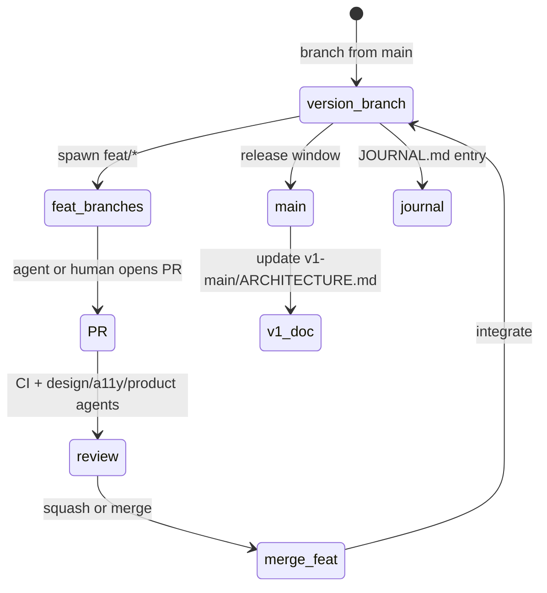

# Branch & Version Management

> **SoT order:** `docs/versions/<name>/` **first** → Git branch name **follows** the directory.

---

## Why directory-first?

- README and agents read **stable paths** (`docs/versions/v2-engineering/`) even when branch is mid-PR.
- Promoting architecture = copy/merge doc sections v2 → v1 on release, not renaming branches retroactively.
- Handoff folders (`docs/handoff-YYYYMMDD/`) remain **point-in-time snapshots**; `docs/versions/` is **living**.

---

## Naming

| Type | Pattern | Example |
|------|---------|---------|
| Production line | `main` | cohort.co.kr |
| Version integration | `version/v<major>-<slug>` | `version/v2-engineering` |
| Agent / human task | `feat/v2-<id>-<slug>` | `feat/v2-003-ips-wizard` |
| Fix on version line | `fix/v2-<slug>` | `fix/v2-macro-cache-ttl` |
| Docs-only | `docs/<slug>` | `docs/journal-2026-07` |

**Rule:** One logical concern per branch. One commit scope per sub-agent task (existing CLAUDE.md discipline).

---

## Lifecycle

1. Create `version/v2-engineering` from `main` when starting v2 batch.
2. Sub-agents use **`feat/v2-*`** branches + **PR to `version/v2-engineering`** (not direct to `main`).
3. Ray (or lead agent) merges PRs after CI + review agents PASS.
4. Release: merge `version/v2-engineering` → `main`, tag `v2.0.0`, update `docs/versions/v1-main/`, write journal.

---

## What not to do

- Long-lived `feat/*` without PR (>48h) — integration tax grows nonlinearly ([Helge Sverre — agentic drift](https://helgesver.re/articles/agentic-drift)).
- Multiple agents on same files without worktree isolation.
- `--no-verify` push (AO-4).

---

## Tags (optional)

- `v1.0.0` — W5 launch baseline  
- `v2.0.0` — first v2 release (CI + IPS + BrokerPort read)
