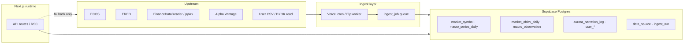

# Data Platform Strategy — DB-first ingest

> **Ray principle (2026-06):** 상용·공개 API든, **법적·기술적 리스크가 허용되면 우리 Postgres(Supabase)에 적재·관리**한다.  
> 런타임은 **DB → (캐시) → UI**; upstream API는 **ETL/worker**만 호출.  
> **Status:** Engineering SoT · v2 구현 시작 · v1은 일부 live fetch 유지

---

## 1. Why DB-first

| Benefit | Example |
|---------|---------|
| **비용·rate limit** | Alpha Vantage 25/day → 한 번 받아 두고 재사용 |
| **속도·안정** | ECOS/FRED 장애 시 어제 스냅샷으로 degrade |
| **백테스트·최적화** | 동일 OHLCV로 반복 시뮬 |
| **감사·재현** | “그날 대시보드가 본 숫자” = `observed_at` + row |
| **개인화** | 사용자 symbol universe만 incremental ingest |

---

## 2. Default architecture



**Rule:** User-facing request path **must not** fan out to N upstream symbols. Read **materialized rows**; stale → background refresh job.

---

## 3. Decision gate — store or live-fetch?

Every new data source passes this checklist:

| # | Question | Store in DB if |
|---|----------|----------------|
| L1 | **재사용**되는가? (2+ users or 2+ requests/day) | Yes |
| L2 | **법적** — ToS allows storage for our use case? | Yes + log `data_source.license` |
| L3 | **PIPA** — personal data? | User table + RLS only; no third-party PII in market tables |
| L4 | **Option B** — becomes “추천” input? | Store **facts** only; never store AI “advice” as ground truth |
| L5 | **Freshness** SLA | Define `max_staleness`; job alerts if exceeded |

**Live-fetch OK (temporary v1):**

- First ship of a series before ETL exists (with short TTL cache)
- One-off admin/debug
- Upstream **explicitly forbids** persistence (then cache-only + legal note)

**Never store:**

- Raw broker credentials (Vault/BYOK pattern)
- Other users’ portfolio positions (no social pool)
- Unlicensed redistribution bundles for resale

---

## 4. Data domains & tables (target schema)

### A. Reference — `market_symbol`

```sql
-- v2 migration (illustrative)
CREATE TABLE market_symbol (
  id uuid PRIMARY KEY DEFAULT gen_random_uuid(),
  exchange text NOT NULL,          -- KRX, NYSE, INDEX
  symbol text NOT NULL,
  currency char(3),
  name text,
  UNIQUE (exchange, symbol)
);
```

### B. Market OHLCV — `market_ohlcv_daily`

See [`backtest-data-strategy.md`](../versions/v3-learning-cycle/backtest-data-strategy.md) (BT-0…BT-3).

```sql
CREATE TABLE market_ohlcv_daily (
  symbol_id uuid REFERENCES market_symbol(id),
  trade_date date NOT NULL,
  open numeric, high numeric, low numeric, close numeric,
  volume bigint,
  source text NOT NULL,            -- fdr, pykrx, alpha_vantage, stooq_import, user_csv
  ingested_at timestamptz DEFAULT now(),
  PRIMARY KEY (symbol_id, trade_date)
);
```

### C. Macro — `macro_observation` (v2 target)

Today: ECOS/FRED **live** + 15m in-memory cache. **Target:** daily (or intraday) upsert.

```sql
CREATE TABLE macro_observation (
  code text NOT NULL,              -- VIXCLS, USDKRW, KR_10Y, ...
  observation_date date NOT NULL,
  value numeric NOT NULL,
  source text NOT NULL,            -- ecos | fred
  fetched_at timestamptz DEFAULT now(),
  PRIMARY KEY (code, observation_date)
);
```

Dashboard RSC → `SELECT … ORDER BY observation_date DESC LIMIT 30` → same API shape as now.

### D. AI cache — already DB-first

| Table | Content |
|-------|---------|
| `aurora_narration_log` | Brief text + `asOfDate` |
| `aurora_chat` | Chat turns (PIPA) |

### E. User-owned — already DB-first

`user_investment_profile`, `watchlist`, `trigger_config`, `behavioral_event`, etc. — **RLS strict**.

### F. Ops — `ingest_run` / `ingest_job`

```sql
CREATE TABLE ingest_job (
  id uuid PRIMARY KEY DEFAULT gen_random_uuid(),
  job_type text NOT NULL,          -- macro_daily | ohlcv_symbol | stooq_bulk
  payload jsonb,
  status text DEFAULT 'pending',   -- pending | running | done | failed
  attempts int DEFAULT 0,
  last_error text,
  created_at timestamptz DEFAULT now()
);
```

PostHog/Sentry: `ingest_job_failed`, `data_staleness_breach`.

---

## 5. Source playbook (store when allowed)

| Source | Store? | Phase | Legal note |
|--------|--------|-------|------------|
| **ECOS / FRED** | ✅ Yes | v2-macro | Public API keys; attribute in UI; rate polite |
| **FinanceDataReader / pykrx** | ✅ Yes (KR OHLCV) | v2-bt1 | Scraping — **참고용** disclaimer; commercial → licensed vendor |
| **Alpha Vantage** | ✅ Yes (US seed) | v2-bt1b | Free tier slow; paid for bulk |
| **Stooq bulk ZIP** | ✅ Yes (one-time) | v2-bt2 | Manual download; no auto-scrape |
| **EODHD / KRX official** | ✅ Yes | v3-bt3 | When revenue / ToS requires |
| **User CSV** | ✅ Yes | v2-bt0 | User data; RLS or user-scoped |
| **Broker BYOK read** | ✅ Positions snapshot | v2 L2 | User consent; encrypt; no cross-user |
| **Claude outputs** | ✅ Cache only | now | Not “market truth”; narration log |

---

## 6. Ingest jobs (who runs what)

| Job | Schedule | Runner |
|-----|----------|--------|
| `macro_observation_daily` | Daily KST 07:00 | Vercel cron or Fly worker |
| `ohlcv_universe_nightly` | Daily KST 18:30 | Fly worker (pykrx/FDR) |
| `ohlcv_backfill_queue` | Continuous | Worker dequeue `ingest_job` |
| `stooq_import` | Manual | CLI script → Postgres |
| Shape C triggers | Every minute | Existing cron (eval only, not ingest) |

**v1 exception:** Macro dashboard may still live-fetch until `macro_observation` ETL merges (v2-7 milestone).

---

## 7. Freshness & fallback

| Layer | Policy |
|-------|--------|
| **Primary** | Read DB where `observation_date >= today - max_staleness` |
| **Degraded** | Serve last row + UI badge “데이터 기준일: YYYY-MM-DD” |
| **Hard fail** | No upstream call from user request; queue refresh job |

Aligns with existing KST + stale annotation on dashboard.

---

## 8. v2 implementation order

| ID | Deliverable |
|----|-------------|
| DP-1 | Migration: `market_symbol`, `market_ohlcv_daily`, `ingest_job` |
| DP-2 | Migration: `macro_observation` + daily cron |
| DP-3 | RSC/API read from DB; remove per-request ECOS/FRED on cache hit |
| DP-4 | Worker Docker image + Fly deploy (OHLCV queue) |
| DP-5 | BT-0 CSV upload API |
| DP-6 | Observability: staleness alerts ([observability.md](./observability.md)) |

Track in [`phase-0-closeout.md`](./phase-0-closeout.md) → `version/v2-engineering` PRs.

---

## 9. Current state (v1 honest map)

| Data | Today | Target |
|------|-------|--------|
| Macro ECOS/FRED | Live fetch + 15m memory cache | `macro_observation` |
| Aurora brief | **DB** (`aurora_narration_log`) | Same |
| Chat | **DB** | Same |
| OHLCV / backtest | None | `market_ohlcv_daily` |
| Triggers | **DB** config; macro input live | macro from DB |

---

## Related docs

- [`backtest-data-strategy.md`](../versions/v3-learning-cycle/backtest-data-strategy.md) — OHLCV tiers BT-0…3
- [`docker-local.md`](./docker-local.md) — local Postgres + worker
- [`observability.md`](./observability.md) — what to alert on
- [`portfolio-tool-roadmap.md`](../handoff-20260611/portfolio-tool-roadmap.md) — M4 backtest worker
