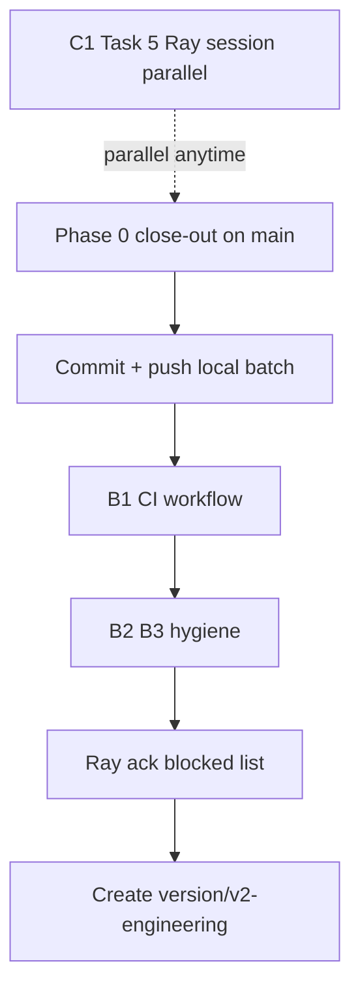

# Phase 0 Close-out — Gate before `version/v2-engineering`

> **Ray criterion (2026-06-12):** pending/in-progress 항목을 **go / defer / blocked** 로 확정하고, **멈춘 상태**에서 v2 시작.  
> **Decision Q4:** CI ≠ v2 blocker; Task 5 ≠ v2 blocker. **Phase 0 sign-off** = v2 blocker.

---

## Exit criteria (all must be ✅)

| # | Criterion | Owner |
|---|-----------|-------|
| E1 | Every queue item has terminal status | Orchestrator |
| E2 | Local uncommitted work **committed + pushed** or explicitly reverted | Ray |
| E3 | `AGENT-RUN-STATUS.md` matches git reality | Agent |
| E4 | **B1 CI** merged on `main` OR documented defer with date | ✅ workflow + test:ci + build |
| E5 | Ray ack on **blocked** items (D2 filter-repo, C1 Task 5 schedule) | Ray |

**When E1–E5 done →** `git checkout -b version/v2-engineering && git push -u origin version/v2-engineering`

---

## Pending inventory (authoritative snapshot 2026-06-12)

### Local uncommitted (must resolve in E2)

| Item | Status | Action |
|------|--------|--------|
| README + docs/versions + engineering + journal | 🔄 | **GO** — commit as `docs: versioned architecture + phase 0` |
| `middleware.ts` landing pass | 🔄 | **GO** — commit with `feat(landing): soft redirect signed-in first visit` |
| `Footer.tsx` 소개 → `/` | 🔄 | **GO** — same commit or docs commit |
| `docker-compose.yml` | 🔄 | **GO** — commit as `chore(docker): local postgres compose` |

### Batch A — deploy

| ID | Task | Status | Action |
|----|------|--------|--------|
| A1 | Macro/Aurora/support/terms | ✅ | Done (remote) |
| A2 | Handoff sync | ✅ | Done |
| A3 | `.env.local.example` TOSS_* | ⬜ | **GO** — quick parent task before v2 |
| A4 | Commit + push local | ⬜ | **GO** — Ray approve commit |
| A5 | Vercel smoke | ⬜ | **GO** — Ray manual after A4 |

### Batch B — machine gate

| ID | Task | Status | Action |
|----|------|--------|--------|
| B1 | GitHub Actions CI | ⬜ | **GO FIRST** on `main` (before v2 branch) |
| B2 | migration history doc | ⬜ | **GO** — can parallel B1 |
| B3 | CLAUDE.md payment drift | ⬜ | **GO** — small |

### Batch C — product

| ID | Task | Status | Action |
|----|------|--------|--------|
| C1 | Task 5 `scoreGlRts` Green | 🚫 | **BLOCKED on Ray typing** — parallel, not v2 gate |
| C2 | profile_snapshot migration | ⬜ | **DEFER → v2** after C1 |
| C3 | IPS wizard spec | ⬜ | **DEFER → v2** (first v2 feat) |
| C4 | Toss lab | ⬜ | **DEFER → v2** (after A3 example) |
| C5 | toss-open-api-lab.md | ⬜ | **DEFER → v2** with C4 |

### Batch D — security

| ID | Task | Status | Action |
|----|------|--------|--------|
| D1 | MCP token cleanup | ⬜ | **GO** — Ray review diff |
| D2 | filter-repo lawyer-attachments | 🚫 | **BLOCKED** — Ray explicit approval |
| D3 | gitleaks | ⬜ | **DEFER** until D2 or independent scan |

### Deferred product (explicit ⏭)

| Item | Action |
|------|--------|
| Chart/time-series UI | ⏭ v2 UI phase |
| Cloud Agent overnight | ⏭ skipped (cost) |
| PostHog survey instrumentation | ⏭ after C1 Green (no score leakage) |
| SEO `/learn/*` | ⏭ v3-learning-cycle |

---

## Recommended sequence (orchestrator executes)

1. **Today:** Finish E2 (commit local), A3, B1, B2, B3  
2. **Ray:** A5 smoke, E5 ack, C1 session when ready  
3. **Then:** Create `version/v2-engineering` — first PR: domain folder scaffold + IPS spec (C3)

**Why CI before v2 branch?**  
Task 5 needs Ray; v2 agents need **PR CI gate**. Shipping B1 on `main` protects all future branches.

**Why not wait for Task 5?**  
Scoring is domain-complete on `main`; v2 IPS work can proceed with Red tests until C1 merges.

---

## v2 first PRs (after branch exists)

| Order | PR | Branch |
|-------|-----|--------|
| 1 | `src/domains/` scaffold + macro extract POC | `feat/v2-001-domain-scaffold` |
| 2 | IPS wizard zod + spec | `feat/v2-002-ips-wizard-spec` |
| 3 | C4 Toss lab (local only) | `feat/v2-003-toss-lab` |

---

## Sign-off

| Role | Phase 0 complete? | Date |
|------|-------------------|------|
| Orchestrator (agent) | ⬜ E1–E4 pending | |
| Ray | ⬜ E5 + A4 | |
