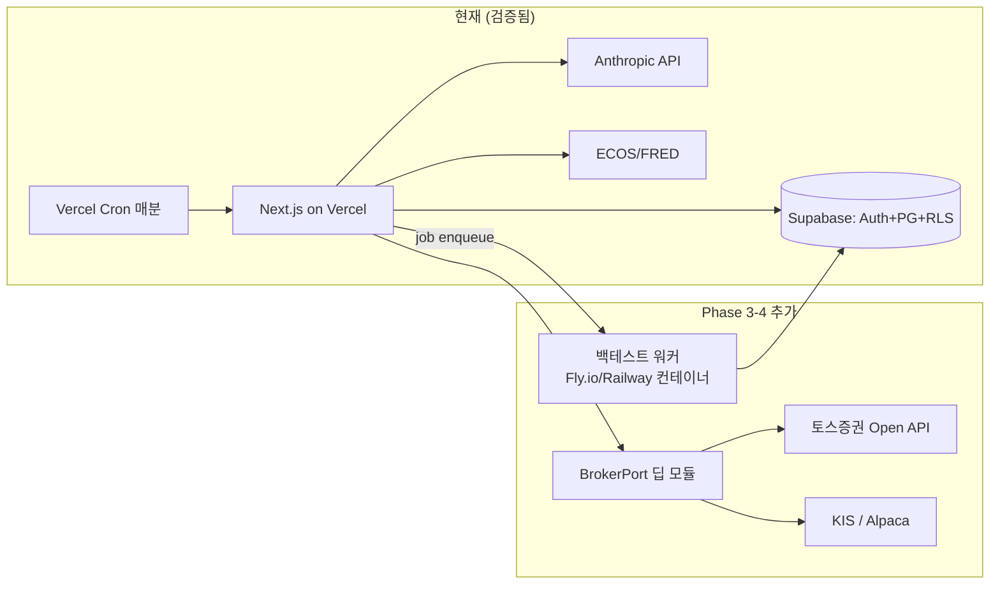

# cohort 아이데이션 문서 (2026-06-11)

> 레포(rayleighko/cohort) 직접 분석 + 행동재무학 1차 자료 검증 + 브로커 API/비용/BM 리서치 기반.
> 검증 못 한 항목은 ⚠️로 표시. 출처는 각 절 하단.

---

## 1. 현재 상태 (As-Is) — 레포 실측

### 1-1. 실제 구조
- **모노레포 아님.** 단일 Next.js 14 App Router 앱 + Supabase. NestJS·Rust 백엔드 없음. (핸드오프 프롬프트의 "pnpm 모노레포" 서술과 다름)
- 스택: Next.js 14.2 / React 18 / TS 5.4 / Tailwind / Supabase(Auth+RLS+Postgres, SQL 마이그레이션 13개) / Anthropic SDK(Sonnet 4.6 페르소나 + Haiku 4.5 안전필터) / Polar 결제 / Resend / web-push / PostHog / Sentry / Vercel(+매분 cron)

### 1-2. 구현된 것
| 영역 | 상태 |
|---|---|
| LLM 챗 "Aurora" | ✅ 비스트리밍 JSON 응답, 멀티턴, 일일 쿼터(Tier0=5회), Haiku/Sonnet 라우팅. **단, 익명 세션 — auth 미연결(`userId: null` 하드코딩)** |
| 자본시장법 안전필터 | ✅ 3단계(정규식→Haiku 분류→리다이렉트), 입출력 양방향 |
| 매크로 대시보드 | ✅ ECOS+FRED 연동, composite score. DART는 스텁 |
| 트리거 알림(Shape C) | ✅ 엔진+쿨다운+Web Push, 매분 cron 평가 |
| 온보딩 설문 | ✅ Q1–Q15 + `user_investment_profile` 테이블 + SegmentClassifier |
| 인증/결제 | ✅ Supabase Auth, Polar(Pro $19/Premium $59) |
| PWA | 🟡 manifest+push는 동작, **fetch 캐싱은 no-op 플레이스홀더** |
| 테스트 | ✅ Vitest 약 36개 파일. e2e는 스크립트만(설정 미발견 ⚠️) |
| **브로커/매매 연동** | ❌ 없음 |
| **백테스팅** | ❌ 없음 |
| **포트폴리오 추적** | ❌ 없음 (watchlist 테이블만 있고 UI 없음) |
| CI | ❌ `.github/` 자체가 없음. pre-commit/pre-push 로컬 훅만 |
| docs/architecture.md, ADR | ❌ 없음 (CLAUDE.md 12.7KB가 사실상 유일한 설계 문서) |

### 1-3. 공개 전 보안/정리 이슈 (발견됨)
1. **`lawyer-attachments-html/`** — 변호사 자문용 첨부 3건에 Polar product ID, 가격 전략, 커밋 해시 등 내부 사업 정보가 공개 레포에 노출 중. **제거 + 히스토리에서도 purge 권장.**
2. CLAUDE.md에 "Repo: plancy-dev/cohort (**private**)"라고 적혀 있으나 실제는 rayleighko 계정 **public**. 의도 확인 필요.
3. 시크릿 커밋 흔적은 없음(.env.local.example만, 전부 빈 값). 단 gitleaks 전체 히스토리 스캔은 미수행 ⚠️.
4. README "Toss Payments KRW V1" ↔ 코드에는 Polar만 존재. 문서-코드 불일치.

### 1-4. 배포 사이트 (cohort.co.kr)
"흔들리지 않는 투자 페이스" — 매크로 한 화면 / composite 기반 분할매수 페이스 / 사용자 trigger 알림. Tier0 무료 + Pro $19. 푸터에 "투자 자문 서비스가 아닙니다" 면책 + 플랜사이 사업자 정보.

**진단:** 현재 cohort는 "투자 페이스 메이커 + 매크로 정보 + LLM 안내자"까지 와 있고, 네가 구상하는 핵심(성향 진단 → 원칙 수립 → 원칙 준수 도움 → 브로커 연동/백테스트)의 **앞 절반(설문·프로파일 테이블)은 씨앗이 있고 뒷 절반은 전부 미착수**다.

---

## 2. 제품 비전 — "투자 MBTI"가 아니라 "투자 규율 코치"

한 문장: **시장이 평온할 때 나를 진단하고 원칙을 문서화하게 만들고, 시장이 흔들릴 때 그 원칙을 내 앞에 소환하는 서비스.**

차별점은 "역(逆)게임화"다. 트레이딩 앱들이 컨페티·푸시로 거래를 늘릴 때(FCA 실측: 푸시알림·경품이 거래빈도 11–12%↑, 위험상품 비중 6–8%↑), cohort는 반대로 마찰을 설계한다. 이건 마케팅 카피이자 학술 근거가 있는 포지셔닝이다.

### 진단 체계 (전부 실존 방법론, 출처 확보됨)
| 기능 | 근거 | 비고 |
|---|---|---|
| 위험감수성 점수 (과학 코어) | **Grable-Lytton 13문항**(1999, α=0.75–0.77, 무료 공개) | 한국어 번안판 타당도는 미검증 ⚠️ — 정직하게 "원척도 번안" 표기 |
| 초간편 1문항 버전 | 미 연준 SCF 단일 문항 | 라이트 온보딩 → 정식 13문항으로 업그레이드 유도 |
| "투자 MBTI" 유형 | **Pompian BIT 4유형**(CFA L3 커리큘럼): Preserver/Follower/Individualist/Accumulator — 유형마다 취약 편향 목록이 매칭됨 | 유형→편향→맞춤 개입 파이프라인이 문헌에 이미 있음 |
| 2축 시각화 | Bailard-Biehl-Kaiser 5-Way (자신감×충동성) | 심리측정 검증은 없는 프레임워크 — 시각화용으로만 ⚠️ |
| 다차원 결과("일상은 모험가, 돈 앞에선 거북이") | **DOSPERT**(위험태도는 영역특수적) | MBTI식 재미 + 학술 근거 |
| 행동 데이터 보강 | 기존 `behavioral_event` 테이블 활용 — 설문(자기보고) + 실제 행동(체류·확인 빈도·트리거 반응)의 2채널 프로파일 | |
| 금투협 5단계 호환 매핑 | 안정형~공격투자형 | 향후 증권사 제휴/라이선스 시 그대로 전환 가능 |

CFA 커리큘럼 스스로 "유형은 혼재하고 변한다"고 경고함 → 단정적 라벨링 대신 "현재 스냅샷 + 재검사" UX.

### 원칙 수립·준수 체계
| 기능 | 근거 |
|---|---|
| **개인 IPS(투자정책서) 위저드** — 손실한계선·월 매수 상한·리밸런싱 규칙·평가주기를 문서화 | CFA Institute 공식 가이드(2010, 원문 확인): IPS = "시장 혼란기에 따를 객관적 행동 지침" |
| **사전서약** — 평온할 때 규칙을 약정, 위반 시도 시 본인이 쓴 약정문 소환 | Thaler-Benartzi SMarT(2004): 사전약정으로 저축률 3.5%→13.6% |
| **회전율 거울** — 사용자 연환산 회전율을 논문 수치와 비교 | Barber-Odean(2000, 원문 확인): 최다 거래 5분위 연 11.4% vs 시장 17.9% (−6.5%p), 평균 가구 회전율 75%+ |
| **처분효과 지수** — "이익은 빨리 팔고 손실은 방치" 비율 | Odean(1998): 이익 종목을 손실 종목보다 ~1.5배 더 잘 매도 |
| 수익률 확인 주기 제어(일간 끄기, 월간 리포트만) | Benartzi-Thaler 근시안적 손실회피(재현성 논쟁 있음 ⚠️ — 표기하고 사용) |
| 매수 전 원칙 체크리스트(긍정적 마찰) | FCA order-review-confirm 권고. "쿨링오프"는 도박 규제에서의 외삽임을 정직하게 표기 ⚠️ |

---

## 3. 규제 가드레일 (구상 중 가장 중요한 수정 사항)

**⚠️ "공격적 투자자에게 기술주/저평가 종목 추천" — 이건 그대로 하면 안 된다.**
한국 기준, 투자자문업(등록제)과 유사투자자문업(신고제)을 가르는 핵심은 **개별성**이다(자본시장법 §101). "당신의 성향엔 이 종목"처럼 개인 맞춤 매매 판단을 제공하는 순간 투자자문업 등록 이슈가 생긴다. 현재 코드의 안전필터(ADVISORY_REQUEST 차단)와 README의 "NO 추천/권장/비중 X%" 원칙이 정확히 이 경계를 지키고 있음 — 이 원칙을 유지해야 한다.

안전한 형태로 변환:
- ❌ "공격투자형이시니 TSLA 추천" → ✅ "공격투자형 사용자들이 일반적으로 검토하는 **자산군/전략 카테고리** 교육 콘텐츠" + "본인이 고른 종목이 본인 원칙(IPS)과 부합하는지 체크"
- 추천의 주어를 항상 **사용자 본인의 원칙 문서**로 둔다. cohort는 거울이지 조언자가 아님.
- 자동매매도 "사용자가 정의한 규칙의 실행 대행"으로, 규칙 생성 주체는 사용자.
- 백테스트 표시: 가정 전체 공시(수수료·슬리피지·기간·유니버스) + "Hypothetical" 라벨 + 과거성과 미보장 고지(SEC Marketing Rule 규범 차용 — 직접 적용 대상은 아니어도 업계 표준).
- 면책 장치(이미 일부 구현): 주문 실행 전 명시적 사용자 확인(서명형 confirm), 모든 주문의 사용자 트리거 로그 보존, "본 서비스는 투자자문·일임이 아님" 반복 고지.
- 향후 진짜 로보어드 가려면: 코스콤 RA 테스트베드(6개월 운용심사) 경로가 존재. 장기 옵션으로만.

**마케팅 주의:** "이 서비스로 투자 수익을 올리고 있다" 홍보는 성과 광고라서 위험 구간. 안전한 카피는 "수익"이 아니라 **행동 변화**: "회전율이 X% 줄었다", "원칙 위반 매매가 줄었다", "패닉 셀을 안 했다". 이건 정직성 원칙과도 일치하고, 실측 가능한 숫자라 포트폴리오 증거로도 더 좋다.

---

## 4. 장기 로드맵 (Phase 0–4)

각 Phase는 수직 슬라이스 단위, 끝마다 PR + 필요 시 ADR.

### Phase 0 — 공개 준비 + 증거물 기반 (1–2주, 잉여시간 기준)
1. `lawyer-attachments-html/` 제거 + `git filter-repo`로 히스토리 purge + gitleaks 전체 스캔
2. GitHub Actions CI (lint·typecheck·test) + branch protection — 현재 0이라 가성비 최고
3. `/docs/architecture.md` (현재 시스템 그대로: C4 Context+Container, 시퀀스 2개 — "챗 안전필터 파이프라인", "cron→트리거 평가→푸시")
4. ADR 백필 3개: 안전필터 3단계 설계 / Haiku-Sonnet 라우팅 / Supabase RLS 격리 — **이미 내린 결정이라 정직하게 "backfilled" 표기**
5. 챗 auth 연결(`userId: null` 해소) + 스트리밍 전환 — 핸드오프 프롬프트의 "LLM Q&A 스트리밍 슬라이스"와 일치

### Phase 1 — 투자 성향 진단 v1 (목표: 첫 바이럴 루프)
- GL-RTS 13문항 + BIT 분류 → 결과 카드(공유 가능 이미지) — MBTI식 공유가 자연 마케팅
- 금투협 5단계 호환 점수 저장(기존 `user_investment_profile` 확장)
- ADR: "성향 진단 체계 선정 — GL-RTS vs 자체 설문 vs DOSPERT" (실제 트레이드오프 문서)

### Phase 2 — IPS(투자 원칙) 위저드 + 사전서약
- 원칙 문서화 → 트리거 엔진과 연결("내 원칙 조건 도달 시 알림" — Shape C 재활용)
- Aurora가 원칙 작성 코치 역할(안전필터 유지)
- 처분효과/회전율 거울은 **수동 거래내역 입력 or CSV 업로드**로 시작 (브로커 연동 전에 가치 검증)

### Phase 3 — 브로커 연동 (읽기 전용 먼저)
- **토스증권 Open API가 게임 체인저**: 2026-05-21 사전 신청 시작(연합인포맥스 확인), REST+WebSocket, KRX+미국주식, 사용자가 직접 키 발급 → **BYOK 모델** 가능. 정식 오픈 여부는 재확인 필요 ⚠️
- 한국 대안: KIS Developers(REST+WS, 모의투자 제공), 키움 REST(2025-03 출시), LS증권
- **미국: Robinhood 주식 공개 API는 없음**(crypto만). 비공식 API는 약관 위반·계정 정지 리스크 — 쓰지 말 것. 미국은 SnapTrade($2/유저/월, 멀티 브로커) 또는 Alpaca로
- 순서: 잔고/체결 조회(읽기) → 처분효과·회전율 자동 계산 → 그 다음에야 주문. **딥 모듈 `BrokerPort`(getPositions/getQuote/placeOrder) 뒤에 브로커별 차이 은닉** — ADR 0002 그대로
- 사용자 API 키 보관 = 최고 민감 정보: Supabase Vault/KMS 암호화, ADR 필수

### Phase 4 — 규칙 실행·백테스트
- 백테스트 워커는 Next.js 밖으로(별도 컨테이너): 엔진은 vectorbt(무료판 유지보수만 ⚠️) 또는 자체 경량 구현(일봉 수준이면 충분, "핵심 로직 직접 타이핑" 원칙에도 부합)
- 데이터: KIS 일봉(무료)+Alpaca 무료(미국 IEX)로 시작
- 주문 멱등성(idempotency key + 상태 머신), 재시도 — ADR 0004, 포트폴리오 핵심 증거물
- 자동매매는 "사용자 정의 규칙 실행 대행" 프레임 유지

---

## 5. 시스템 설계 밑그림

### 현재 → 목표 아키텍처

설계 원칙(핸드오프 프롬프트의 4원칙과 정합):
- **Deep Modules**: `BrokerPort`(placeOrder/getQuote/getPositions), `ProfileEngine`(설문+행동→성향), `PrincipleGuard`(매매 의도 vs IPS 대조) — 인터페이스 3–4개 메서드, 복잡성은 내부에
- **Ubiquitous Language**: 성향(profile)·원칙(principle/IPS)·서약(commitment)·트리거·회전율(turnover)·처분효과(disposition) — DB·코드·UI 동일 단어. 이미 `trigger_config`, `behavioral_event` 등 잘 가고 있음
- 모노레포 전환은 백테스트 워커가 생기는 Phase 4에 가서 결정 (지금 하면 오버엔지니어링 — 이것 자체가 ADR감)
- 비기능: 챗 first-token p95(스트리밍 전환 후 측정 — 벤치마크 증거물), 주문 정합성(멱등성), LLM 비용/유저 상한(쿼터 이미 있음)

---

## 6. 월 지출 추정 (2026-06 가격 직접 확인)

| 항목 | MVP(0–100명) | 1,000명 |
|---|---|---|
| Supabase | $0 (Free) | $25–60 (Pro+초과) |
| Vercel | $0 (Hobby)* | $20–50 (Pro) |
| 시세 데이터 | $0 (KIS+Alpaca/Finnhub 무료) | $29–99 (Massive≈구 Polygon / Alpaca SIP) |
| LLM (Haiku $1/$5, Sonnet $3/$15 per MTok, 캐시 히트 $0.10) | $10–50 | $150–500 |
| 백테스트 워커 | — | $10–30 |
| 기타(도메인·이메일) | $1–2 | $10–25 |
| **합계** | **~$11–80/월** | **~$250–760/월** |

*Vercel Hobby는 상업적 사용 제한 — 과금 시작하면 Pro 필요.
1천 명 규모의 지배 비용은 LLM → Haiku 우선 + 프롬프트 캐싱 + 필요시 Sonnet 승격(이미 구현된 라우팅이 정확히 이 레버). **손익분기: Pro $19 기준 유료 전환 2–4%면 1천 명 시점 비용 커버.**

---

## 7. 비즈니스 모델

시장 가격대(확인치): Composer $24/월, TradingView $14.95–69.95/월, Nitrogen(B2B) ~$99/월/어드바이저 ⚠️, 핀트 AUM 연 0.768–1.176%(일임 라이선스 전제).

제안 — **라이선스 없는 "디시플린 코칭 도구" 구독** (규제상 가장 안전):
- **Free**: 1문항 진단 + 매크로 대시보드 + 챗 5회/일 (현행 Tier0)
- **Pro $19/월 (현행 유지)**: 풀 진단(13문항+BIT) + IPS 위저드 + 트리거 무제한 + 챗 상향 + 회전율/처분효과 리포트
- **Premium $59 → 재검토**: 브로커 연동·백테스트·규칙 실행이 들어오기 전엔 근거 약함. Phase 3 이후 "연동 계좌 수·백테스트 횟수"로 차별화
- 장기 옵션: B2B(자문사·핀플루언서에 진단 위젯 제공 — Nitrogen 모델), 증권사 제휴(금투협 5단계 호환 매핑이 자산이 됨)

마케팅 순서(네 계획 보정): 지인 → 쓰레드/레딧(r/investing, r/Korea_invest 등) 국·영문. 단 §3대로 **수익 자랑이 아니라 행동 변화 스토리**("3개월간 충동매매 0회, 회전율 60%↓")로. 진단 결과 공유 카드가 유기적 유입 루프.

---

## 8. AI-Native 개발 루프 (프롬프트 → 하네스 → 루프)

이미 레포에 `.claude/`(agents 3, commands 6, memory 24, skills 4) + pre-commit/pre-push 훅 — 하네스 단계 중반까지 와 있음. 다음 단계:

1. **하네스 완성**: GitHub Actions CI가 최우선(현재 0). lint·typecheck·test가 머신 게이트가 되어야 에이전트 루프가 안전해짐. + PR 템플릿(무엇/왜/트레이드오프/테스트/셀프리뷰 체크리스트)
2. **루프 엔지니어링**: "토큰 예산 내 자율 개발" = ①스코프가 명확한 이슈(수직 슬라이스 단위) ②성공 판정 머신화(테스트 통과+CI 그린) ③예산 상한(세션당 토큰/시간) ④결과는 반드시 PR로 — 사람(너)이 머지 게이트. 핵심 모듈(멱등성·권한·브로커)은 루프 제외, 네가 직접 타이핑 — 핸드오프 원칙 그대로
3. **운영 중 루프**: PostHog 이벤트 → 주간 요약 → 이슈 자동 생성 → 백로그. Sentry 에러 → 재현 테스트 작성까지를 에이전트에, 수정 머지는 사람에
4. 이 루프 설계 자체를 `/docs/adr/` + 블로그 글로 — "AI-native 솔로 개발 운영기"는 갭 A(다인 조직 방식의 증거)를 정확히 때리는 콘텐츠

---

## 9. 열린 질문 (다음 아이데이션 주제)

1. Aurora/Vesper 마스코트 듀얼 페르소나 — 진단 유형과 연결할까? (예: 유형별로 코치 톤 변경)
2. 토스 Open API 정식 오픈 시점 확인 → BYOK 온보딩 UX (키 발급 가이드가 진입장벽)
3. 진단 공유 카드의 바이럴 설계 vs "역게임화" 브랜드의 긴장 — 공유는 게임화 아닌가?
4. 핸드오프 프롬프트의 스택 서술(모노레포/NestJS/Rust) 수정 필요 — 실제 레포 기준으로
5. README의 Toss Payments vs 코드의 Polar — 한국 사용자 KRW 결제 전략

---

## 출처 (핵심만)

**행동재무 (원문 직접 확인 표시)**
- Grable & Lytton RTS: openjournals.libs.uga.edu/fsr/article/view/3240 / 13문항 PDF: team-treatment.squarespace.com/s/2019-12-31-Grable-Lytton-Risk-Assessment.pdf
- Barber & Odean 2000 [원문 확인]: faculty.haas.berkeley.edu/odean/papers/returns/individual_investor_performance_final.pdf
- Odean 1998 처분효과: faculty.haas.berkeley.edu/odean/papers%20current%20versions/areinvestorsreluctant.pdf
- Pompian BIT: michaelpompian.com/the-investor-types/ (Wiley, CFA L3 커리큘럼)
- DOSPERT: business.columbia.edu/cds/research/research-tools/dospert-scale
- CFA IPS 가이드 [원문 확인]: rpc.cfainstitute.org (Elements of an IPS for Individual Investors)
- Thaler & Benartzi SMarT: anderson.ucla.edu/faculty/shlomo.benartzi/savemore.htm
- FCA Gaming Trading [원문 확인]: fca.org.uk/publications/research-articles/gaming-trading-how-trading-apps-could-be-engaging-consumers-worse

**규제**
- 자본시장법 §101 유사투자자문: moef.go.kr/sisa/dictionary/detail?idx=1989
- 금투협 표준투자권유준칙(5단계): law.kofia.or.kr
- FINRA Rule 2111: finra.org/rules-guidance/rulebooks/finra-rules/2111
- 코스콤 RA 테스트베드: koscom.co.kr/portal/main/contents.do?menuNo=200590
- SEC Marketing Rule(가상성과): innreg.com/blog/sec-marketing-rule

**API·가격**
- 토스증권 Open API(2026-05-21 사전신청): v.daum.net/v/20260521073602305 / corp.tossinvest.com/ko/open-api
- KIS Developers: apiportal.koreainvestment.com / github.com/koreainvestment/open-trading-api
- 키움 REST: openapi.kiwoom.com / Robinhood(crypto만): docs.robinhood.com
- SnapTrade: snaptrade.com/pricing / Alpaca: docs.alpaca.markets
- Supabase: supabase.com/pricing / Vercel: vercel.com/pricing
- Claude 가격: platform.claude.com/docs/en/about-claude/pricing / OpenAI: developers.openai.com/api/docs/pricing
- Composer: composer.trade/pricing / TradingView: tradingview.com/pricing / 핀트: fint.co.kr
