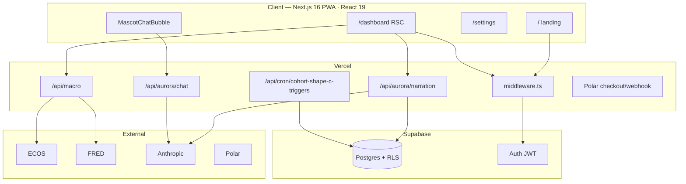

# v1-main — Current Architecture (`main`)

> **Branch:** `main` · **Live:** [cohort.co.kr](https://www.cohort.co.kr/)  
> **Product:** Option B — 정보 + 도구 + 의사결정 지원 (투자 일임·자문 아님)

> **Stack (2026-06):** Next.js **16** · React **19** · TypeScript **5.9** · Tailwind **3.4** · Vitest **3** · pnpm  
> **Not in repo:** NestJS, Rust backend, monorepo — single Next app + Supabase only.

---

## Diagram

---

## Core data paths

| Surface | Flow | Freshness |
|---------|------|-----------|
| Macro dashboard | RSC `getMacroSnapshot()` → ECOS/FRED | KST dates, ~15m in-memory cache, `force-dynamic` |
| Aurora brief | Archive RSC → SWR POST narration → Claude → `aurora_narration_log` | Cache by `asOfDate`; stale archive fallback |
| Chat | Client POST → 3-layer safety → quota by tier | Per-request |
| Shape C triggers | Vercel cron **only** (not macro) | Every minute, idempotent |

---

## Security boundary

- **RLS** on user tables; service role only on server routes (cron, webhook, narration insert).
- **Safety filter:** regex → Haiku → redirect (chat bidirectional).
- **No advisory copy** in prompts + tests + pre-push.

---

## Session routing (2026-06)

Logged-in user, first `/` visit per browser session → `/dashboard`.  
Cookie `cohort-landing-pass` allows return via footer **소개** → `/`.

---

## Key paths

| Area | Entry files |
|------|-------------|
| Routing | `src/middleware.ts` |
| Macro | `src/lib/macro/snapshot.ts`, `src/app/(dashboard)/dashboard/page.tsx` |
| Aurora | `src/app/api/aurora/narration/route.ts`, `src/lib/claude/safety-filter.ts` |
| Triggers | `src/app/api/cron/cohort-shape-c-triggers/route.ts` |
| Schema | `supabase/migrations/` |

---

## v1 explicit non-goals

- Broker BYOK / order execution
- Backtest worker
- Quiz gating before signup
- Redis / multi-region
- Full e2e CI on GitHub Actions

**Next target:** [`../v2-engineering/ARCHITECTURE.md`](../v2-engineering/ARCHITECTURE.md)
