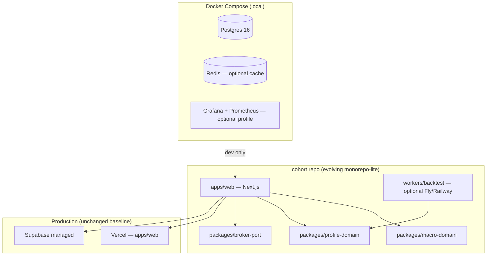

# v2-engineering — Target Architecture

> **Branch:** `version/v2-engineering` *(create after [Phase 0 close-out](../../engineering/phase-0-closeout.md))*  
> **Horizon:** 단기 0–4주 + 중기 1–3개월 ([portfolio-tool-roadmap](../../handoff-20260611/portfolio-tool-roadmap.md))  
> **Methods:** TDD + DDD (bounded contexts) — [`../../engineering/tdd-ddd-playbook.md`](../../engineering/tdd-ddd-playbook.md)

---

## Design intent

v1 = **ship fast, monolith, vault-aligned**.  
v2 = **same product boundary (Option B)**, but **engineering discipline** for portfolio tool ladder L1–L2:

- CI as machine gate (GitHub Actions)
- Domain modules with tests-first
- Local Docker stack for Postgres + optional worker
- Sub-agents on **short-lived branches → PR → human merge**
- Observability runbooks (what to watch when something breaks)

---

## Target diagram

**Note:** v2 starts with **logical packages inside one repo** (`src/domains/*` or `packages/*`) before splitting repos. Physical monorepo split is v2 late / v3 if needed.

---

## Bounded contexts (DDD)

| Context | Responsibility | v2 deliverables |
|---------|----------------|-----------------|
| **Macro** | ECOS/FRED snapshot, composite, narration input | Extract pure functions; contract tests |
| **Profile** | GL-RTS, IPS draft, `user_investment_profile` | `scoreGlRts` Green; IPS wizard schema |
| **Principle** | IPS rules, pre-commitment, guard copy | PrincipleGuard hooks (no auto-trade) |
| **Broker** | `BrokerPort` interface, read-only adapters | Toss lab local; KIS read stub |
| **Pace** | Shape C triggers, behavioral events | Cron + idempotency tests |
| **Compliance** | Safety filter, PIPA delete, legal surfaces | No change to boundary |

Contexts talk via **application services** and **shared types** — not direct DB cross-queries from UI.

---

## v2 milestone map

| ID | Outcome | TDD anchor |
|----|---------|------------|
| V2-1 | `.github/workflows/ci.yml` | lint + tsc + vitest on PR |
| V2-2 | `scoreGlRts` / `classifyBit` Green | Red tests → implementation |
| V2-3 | IPS wizard (L1) | API contract test + RLS test |
| V2-4 | `BrokerPort` + Toss lab read-only | Mock adapter tests |
| V2-5 | Docker Compose dev DB | smoke script in CI optional job |
| V2-6 | Drift dashboard scaffold (L2) | fixture portfolio → drift calc unit tests |

---

## Branch ↔ doc sync rule

1. Edit **`docs/versions/v2-engineering/ARCHITECTURE.md`** when target architecture changes.
2. Implement on **`version/v2-engineering`** or **`feat/v2-<ticket>-<slug>`** branched from it.
3. On merge to `main`, **promote** stable parts into `v1-main/ARCHITECTURE.md` and journal entry.

---

## Explicit deferrals (still Option B)

- L4 approve-then-order (needs ADR + lawyer review path)
- Quiz gate blocking signup (see v3-learning-cycle)
- Production Grafana (use Sentry + PostHog first; local Grafana for learning)
