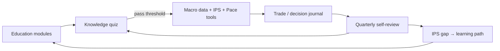

# v3-learning-cycle — Vision (Education · Quiz · Review · Backtest)

> **Branch:** `version/v3-learning` *(future — after v2 L1–L2 stable)*  
> **Status:** Product vision + regulatory guardrails — **not scheduled for v1/v2 ship**

---

## Product thesis

사용자가 **본인 전략(IPS)** 을 갖고, **뇌동매매를 줄이기 위해** 학습·검증·복기 주기를 cohort와 함께 돈다.

- 초심자: **교육 모듈 → 퀴즈 → 합격 점수** 후 도구 이용 (마찰 = 역게임화, FCA-style friction — not gambling cooling-off)
- 숙련자: 분기/반기 **재퀴즈 + 실적 복기 + IPS 갭 분석**
- 공통: **투자 일지**, 실수 기록, Aurora/Vesper는 **코치 톤** (추천/종목 처방 금지)

---

## Learning loop (target UX)

---

## Quiz & gating — **Soft gate (Ray 2026-06-12, locked)**

| Principle | Implementation |
|-----------|----------------|
| **Not investment advice** | Quiz = **개념 이해** (분산, 비용, 손실한계, IPS, 편향) — 종목/타이밍 없음 |
| **Grable-Lytton / BIT** | Onboarding 설문과 **별도** — “금융 리터러시” 퀴즈 |
| **Pass threshold** | e.g. 80%; 미통과 → **교육 모듈** (paywall 아님) |
| **Re-certification** | **분기 필수** — 미완 시 Q1과 동일 soft gate (7일 grace + 리마인더) |
| **Audit** | `learning_attempt`, `quiz_score`, `quiz_expires_at`, `ips_ack_version` |

**Founder decisions:** [`../../engineering/founder-interview-log.md`](../../engineering/founder-interview-log.md)

### Soft gate — always open (no quiz)

| Surface | Why open |
|---------|----------|
| `/` landing, `/learn/*` 읽기 | Acquisition + education |
| `/dashboard` **macro indicators only** (ECOS/FRED cards, composite) | 저위험 시장 **데이터**; Option B 면책 |
| `/privacy`, `/terms`, `/settings` (계정) | PIPA |
| 로그인 / 회원가입 | — |

### Soft gate — **locked until quiz pass** (initial + quarterly)

투자·전략에 영향, **대화형 AI**, 또는 **준비 없이 보면/하면 안 되는** 영역:

| Surface | Lock reason |
|---------|-------------|
| **Aurora macro brief** (narration) | LLM 해석 — 오해·의존 위험 |
| **Aurora/Vesper 채팅** | 대화 주제 예측 불가; safety filter만으로는 UX 목적 미달 |
| IPS 위저드 작성·수정 | 전략 문서화 — 이해 없이 쓰면 형식주의 |
| Shape B watchlist / 목표 비중 입력 | 본인 목표 설정 = 행동 영향 |
| Shape C 트리거 설정·알림 ON | “행동 신호” — 오설정 위험 |
| Drift / portfolio mirror (L2) | 목표 대비 괴리 — 해석 필요 |
| Broker BYOK 연결 | 계좌 연동 |
| Backtest 실행 | 시뮬 결과 오해 방지 |
| L4 approve-then-order preview | 실행 직전 |

**Ray 2026-06-12:** brief + chat **둘 다 잠금**. “불편하면 퀴즈를 푼다” = 역게임화 의도.

**Implementation sketch:** `requireLearningGate()` on `/api/aurora/*`, chat bubble, IPS/trigger routes; dashboard shows macro cards + **locked** narration placeholder until pass.

**V1 note:** Gate ships in v3; until then Aurora remains open in production — doc is target behavior.

---

## Quarterly review surface — **mandatory re-quiz**

분기마다 **필수 재퀴즈** (페이스 메이커 / PT metaphor). 미완 시 위 locked surfaces 동일 적용.

User-authored review (Option B):

- “이번 분기 전략 요약” (free text + IPS snapshot)
- “실수/편향 메모” (journal entries aggregate)
- “다음 분기 보완 1–3项” (checklist — user fills, not AI prescribes)

**No:** leaderboard, social comparison, “you underperformed vs cohort average”.

---

## Backtest (quant scaffold)

| Layer | v3 scope |
|-------|----------|
| Input | User portfolio weights + **user-entered cost basis** (no custody) |
| Data | **Tiered ingest** — CSV → KR ETL → US seed → paid at scale |
| Engine | Worker (`workers/backtest`) — IPS rules, event-driven |
| Output | Equity curve, MDD, turnover — **educational** only |

**Data strategy (sources, cost, PG schema):** [`backtest-data-strategy.md`](backtest-data-strategy.md)

---

## SEO & content (incremental)

- Public education articles (vault 24 baseline) → `/learn/*` static/MDX
- Quiz landing pages long-tail (“분산투자 퀴즈”) — **no stock tips**
- sitemap + structured data per article; defer until v2 CI stable

---

## Dependencies

- v2 Profile + IPS wizard
- v2 BrokerPort read (optional for “actual vs simulated” compare)
- Compliance review before **quiz gate** on production (soft gate copy + unlock UX)

Aligns with [portfolio-tool-roadmap](../../handoff-20260611/portfolio-tool-roadmap.md) M4.
